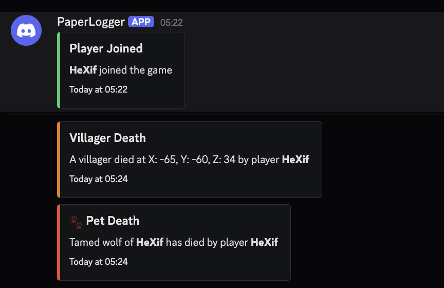
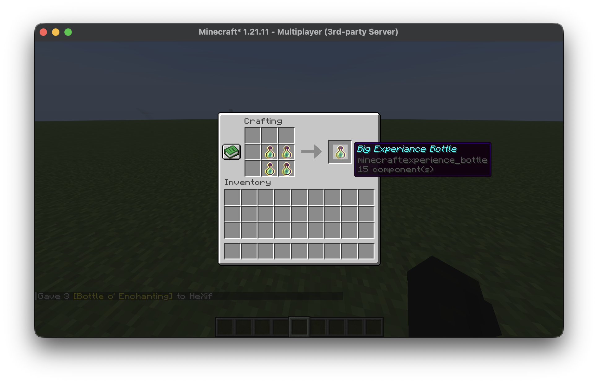
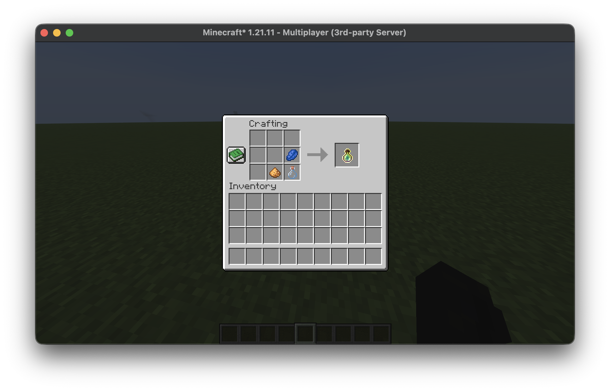
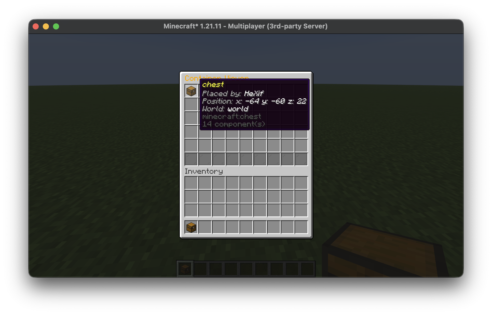

<div align="center">
  
  <h1>HeXifTools</h1>
  <p>Random Utility Minecraft Paper Plugin<p>
  <b align="center">Version: 1.21.11 | Loader: Paper</b>
</div>

## wth is hexiftools?
This started off as just a random project as i wanted to try java, it contains random utility and strange features that i thought would be cool to add. Theres no real purpose for this mod its just helpful for me and i had a BLAST(..) making it.

## Whats added?

- Discord webhook notifacations
- Legacy "§" text formatting on anvils and signs with "&"
- Place blocker
- Custom Items (Big Exp Bottle)
- Custom Recipes
- Container / Placement Tracking
- ToDo system

## Setup

1. Download the latest [release](HYPERLINKHERE)
2. Move it to /plugins dir of server
3. Start server once and open config.yml in /plugins/HeXifTools
4. Fill out fields (webhook url, etc)
5. Done! run

## What does what?

### Discord Webhooks
- Sends a variety of notifactions via a webhook when certain events happen
- All events are configureable via ```/ht config toggle```
- Logs on: Villiger death, pet death, player death (if hardcore), players joining/leaving
  <br>
  

### Sign/Anvil Formatting
You used to be able to put "§x" in your message and format text with bold letters or colours
- Reintroduces this feature using the & symbol instead
- works the exact same as § used to
  <br>
  

### Place Blocker
- Allows server admins to block players from placing specific blocks
- Configureable via the ```config.yml``` or ```/ht config``` command
  <br>
  

### Custom Items
- Custom items cannot be created from the plugin config
- Hardcoded items are added in ```CustomItems.java```
### Custom Items - Big Exp Bottle
- Crafted from 4 exp bottles
- Same as normal exp bottles but gives 5x the amount of XP
- Shift + Throwing does a cluster throw, throwing 4 exp bottles at once
  <br>
  
  

### Custom Recipes
- Allows admins to create their own recipes via an in-game GUI
- Recipes are stored in ```config.yml``` and are re-loaded on server restart
- All players can use custom recipes but only admins can create them
  <br>
  
  

### Container/Placement Tracking
- Track certain blocks placed around the world
- Shows position, block and the player who placed it
- Viewable via an in-game GUI
  <br>
  

### ToDo System
- Add, view, and complete todos in game
- Assign todos to specific people or everyone
- Assigned todos are shown on player join
- Use `/ht todo create|view|complete` to manage your list


## Dev Notes
Coding is java is quite annoying i really like its IntelliSense compared to languages like python though its much smarter. I ran into many issues with stuff i wanted to make purely because this is a server-side plugin and not a mod. I couldn't figure out how to register an item in minecraft (e.g. with a mod where it creates an item with MODID:item_name) so the first custom item is a exp bottle just with different logic, love it still.